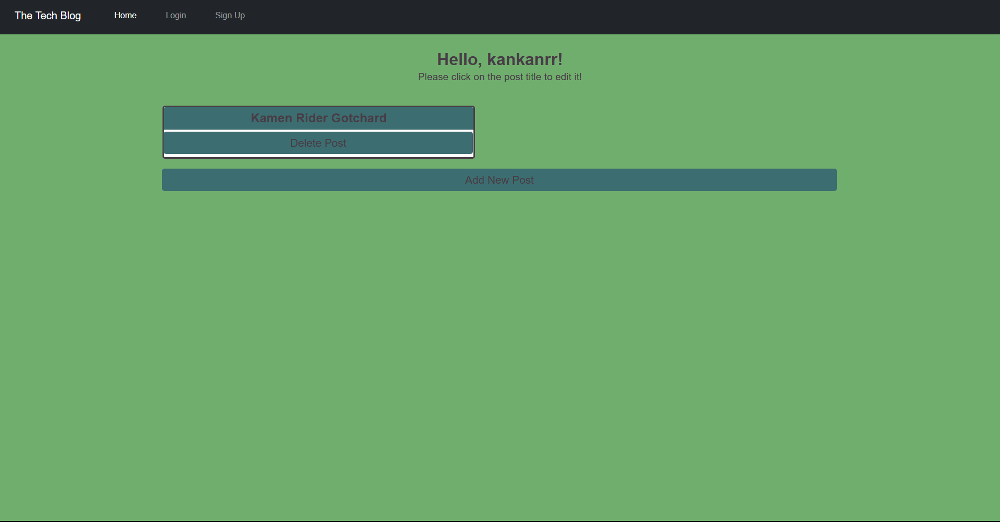

# Tech Blog Page

## Description

This project is a full-stack blog page application where users can login to post or comment on a tech blog. It uses handlebars along with MySQL2, Sequalize, Express, dovenv, bcrypt, express-session and connect-session sequalize.

## How to install ?

1. `git clone` the repo
2. fill in vars in your `.env`
3. run `npm i` to install deps
4. run `npm start` to run the app

## Usage

Heroku Link: https://tech-blog-page-28c13c5c67a8.herokuapp.com/

Once on the site, be sure to sign up using the sign up feature (requires a password that is 8 characters long). Then you should have the option to create posts, then view them as per below:

## Credits

Sameer Mirza | Columbia University Coding Bootcamp
